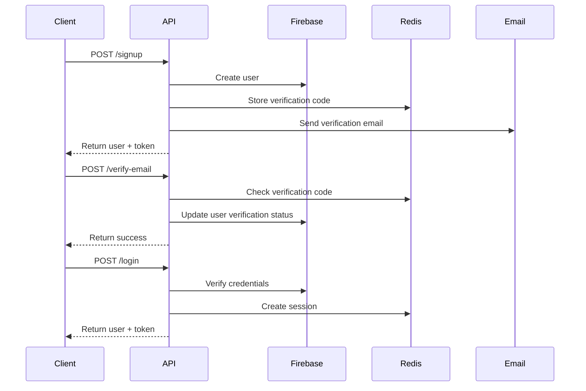

# Authentication API

The authentication API provides endpoints for user registration, login, email verification, and password management.

## Base URL

```
Development: http://localhost:3000/api/auth
Production: https://your-api-domain.com/api/auth
```

## Authentication Flow



## Endpoints

### Register User

Create a new user account.

**POST** `/signup`

#### Request Body

```json
{
  "name": "John Doe",
  "email": "john@example.com",
  "password": "SecurePassword123!",
  "confirmPassword": "SecurePassword123!",
  "userType": "patient"
}
```

#### Validation Rules

- `name`: 2-50 characters, required
- `email`: Valid email format, required, unique
- `password`: Minimum 8 characters, must contain uppercase, lowercase, and number
- `confirmPassword`: Must match password
- `userType`: Must be "patient" or "therapist"

#### Response

```json
{
  "user": {
    "id": "uuid-string",
    "name": "John Doe",
    "email": "john@example.com",
    "userType": "patient",
    "isEmailVerified": false,
    "createdAt": "2024-01-01T00:00:00.000Z",
    "updatedAt": "2024-01-01T00:00:00.000Z"
  },
  "token": "jwt-token-string",
  "message": "Account created successfully. Please check your email for verification code."
}
```

#### Error Responses

```json
// 400 - Validation Error
{
  "message": "Validation failed",
  "errors": [
    {
      "field": "email",
      "message": "Invalid email format"
    }
  ]
}

// 400 - User Already Exists
{
  "message": "User with this email already exists"
}
```

### Login User

Authenticate an existing user.

**POST** `/login`

#### Request Body

```json
{
  "email": "john@example.com",
  "password": "SecurePassword123!"
}
```

#### Response

```json
{
  "user": {
    "id": "uuid-string",
    "name": "John Doe",
    "email": "john@example.com",
    "userType": "patient",
    "isEmailVerified": true,
    "profile": {
      "age": 30,
      "gender": "male",
      "mentalHealthConcerns": ["anxiety", "stress"]
    }
  },
  "token": "jwt-token-string",
  "message": "Login successful"
}
```

#### Error Responses

```json
// 401 - Invalid Credentials
{
  "message": "Invalid email or password"
}
```

### Verify Email

Verify user's email address with verification code.

**POST** `/verify-email`

#### Headers

```
Authorization: Bearer <jwt-token>
```

#### Request Body

```json
{
  "code": "123456"
}
```

#### Response

```json
{
  "user": {
    "id": "uuid-string",
    "name": "John Doe",
    "email": "john@example.com",
    "userType": "patient",
    "isEmailVerified": true
  },
  "message": "Email verified successfully"
}
```

#### Error Responses

```json
// 400 - Invalid Code
{
  "message": "Invalid or expired verification code"
}

// 401 - No Token
{
  "message": "No token provided"
}
```

### Logout User

Invalidate user session.

**POST** `/logout`

#### Headers

```
Authorization: Bearer <jwt-token>
```

#### Response

```json
{
  "message": "Logout successful"
}
```

### Forgot Password

Request password reset email.

**POST** `/forgot-password`

#### Request Body

```json
{
  "email": "john@example.com"
}
```

#### Response

```json
{
  "message": "If an account with that email exists, we have sent a password reset link."
}
```

### Reset Password

Reset password using reset token.

**POST** `/reset-password`

#### Request Body

```json
{
  "token": "reset-token-uuid",
  "newPassword": "NewSecurePassword123!"
}
```

#### Response

```json
{
  "message": "Password reset successful. Please log in with your new password."
}
```

### Continue as Guest

Create a guest session with limited access.

**POST** `/guest`

#### Response

```json
{
  "guestToken": "guest-jwt-token",
  "message": "Guest session created successfully"
}
```

## Authentication Headers

For protected endpoints, include the JWT token in the Authorization header:

```
Authorization: Bearer <jwt-token>
```

## Rate Limiting

All authentication endpoints are rate-limited:

- **Window**: 15 minutes
- **Max Requests**: 100 per IP address
- **Response**: 429 Too Many Requests

```json
{
  "message": "Too many requests from this IP, please try again later."
}
```

## Error Handling

### Standard Error Response Format

```json
{
  "message": "Error description",
  "errors": [
    {
      "field": "fieldName",
      "message": "Field-specific error message"
    }
  ]
}
```

### HTTP Status Codes

- `200` - Success
- `201` - Created (successful registration)
- `400` - Bad Request (validation errors)
- `401` - Unauthorized (invalid credentials/token)
- `403` - Forbidden (insufficient permissions)
- `429` - Too Many Requests (rate limit exceeded)
- `500` - Internal Server Error

## Security Features

### Password Security

- Passwords are hashed using bcrypt with 12 salt rounds
- Minimum password requirements enforced
- Password confirmation required during registration

### JWT Tokens

- Tokens expire after 7 days by default
- Include user ID, email, and user type in payload
- Signed with secure secret key

### Session Management

- Sessions stored in Redis with TTL
- Session validation on each protected request
- Automatic session cleanup on logout

### Input Validation

- All inputs validated using express-validator
- Email normalization and sanitization
- SQL injection and XSS protection

## Code Examples

### Frontend (React Native)

```typescript
import { authAPI } from '../services/authAPI';

// Register user
const handleSignup = async (userData: SignupData) => {
  try {
    const response = await authAPI.signup(userData);
    console.log('User registered:', response.user);
  } catch (error) {
    console.error('Signup failed:', error);
  }
};

// Login user
const handleLogin = async (credentials: LoginCredentials) => {
  try {
    const response = await authAPI.login(credentials);
    // Store token securely
    await Keychain.setInternetCredentials(
      'mental_health_app',
      credentials.email,
      response.token
    );
  } catch (error) {
    console.error('Login failed:', error);
  }
};
```

### Backend Testing

```typescript
import request from 'supertest';
import app from '../app';

describe('POST /api/auth/signup', () => {
  it('should register a new user', async () => {
    const userData = {
      name: 'Test User',
      email: 'test@example.com',
      password: 'Password123!',
      confirmPassword: 'Password123!',
      userType: 'patient',
    };

    const response = await request(app)
      .post('/api/auth/signup')
      .send(userData)
      .expect(201);

    expect(response.body).toHaveProperty('user');
    expect(response.body).toHaveProperty('token');
  });
});
```

## Next Steps

- [User Management API](/api/user-management) - Manage user profiles and preferences
- [Error Handling](/api/error-handling) - Comprehensive error handling guide
- [Security Guide](/guide/features/security) - Security best practices and implementation